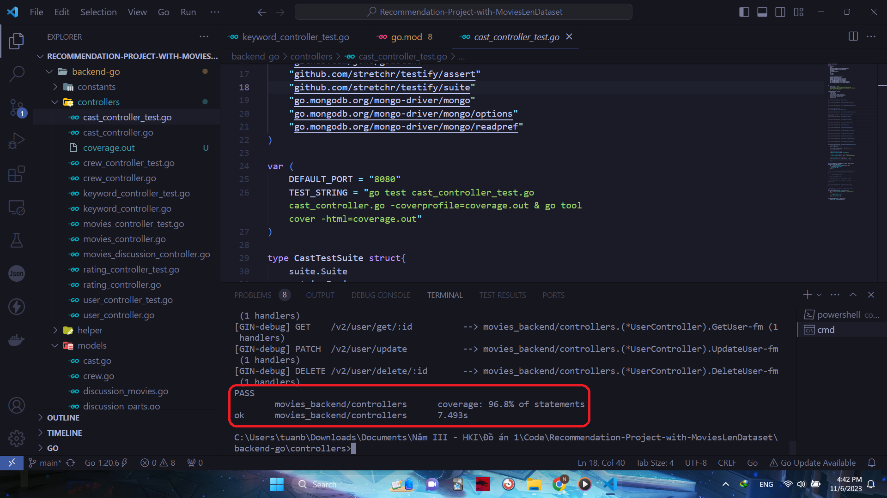
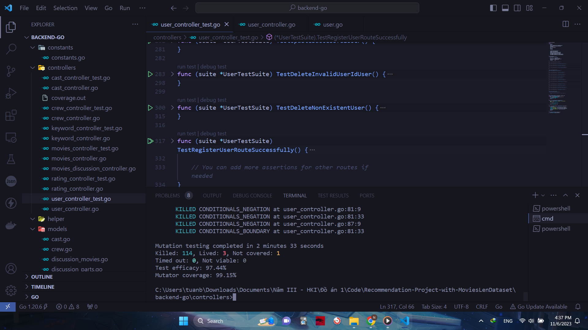

# Recommendation-Project-with-MoviesLenDataset

## Testing

### Unit Testing
The package used to write test is [testify](https://github.com/stretchr/testify).
Testing coverage: 96.8% 

The test coverage for each controller:

[Controller test coverage](Go Coverage Report.html)

### Mutation Testing

