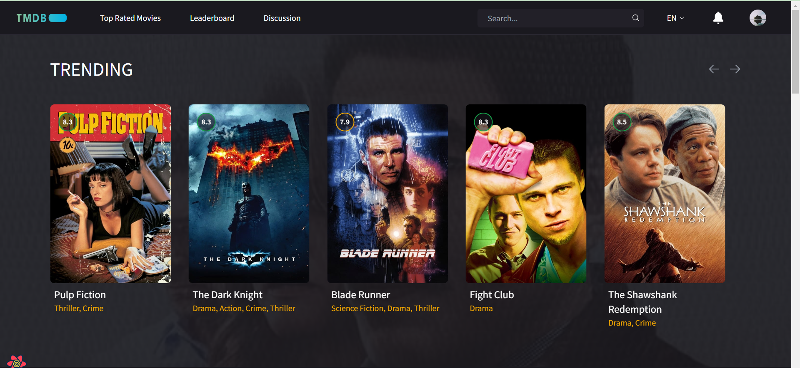
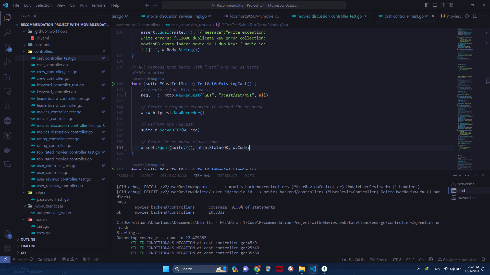
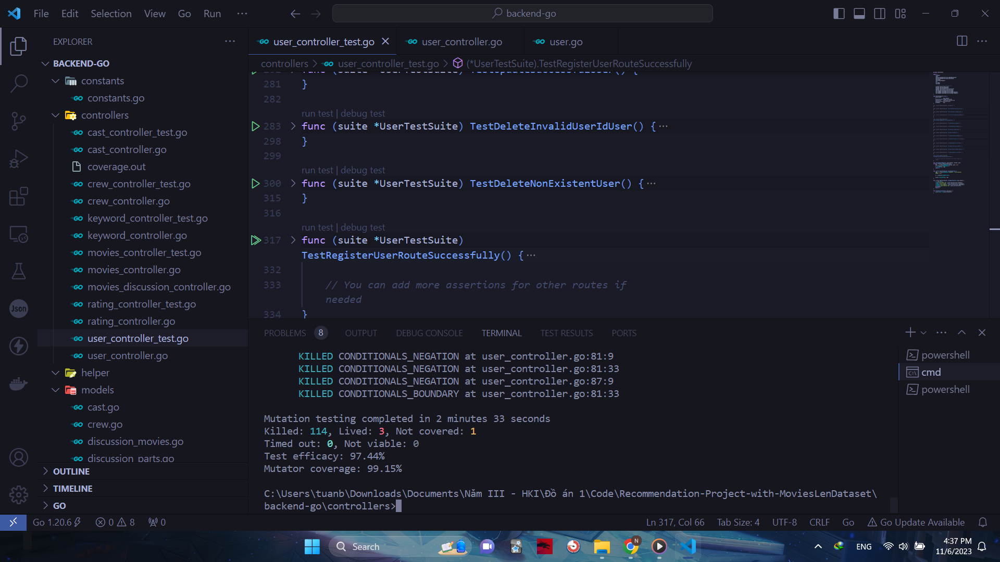

# Recommendation-Project-with-MoviesLenDataset

# Về project
Mục tiêu chính của đề tài này là nghiên cứu và so sánh hiệu quả của nhiều thuật toán khuyến nghị trong việc đề xuất nội dung cho User, đồng thời xây dựng một ứng dụng minh họa giúp trực quan hóa quá trình và kết quả của các thuật toán này

# Chức năng
Project gồm một số chức năng sau: 
- See Personal Movie Recommendation
- See Leaderboard
- See Top Rated Movies & Popular Movies
- Join Discussion
- Account Management
- Search Movies
- See Movie Details

# Công cụ sử dụng
- MongoDB Database
- Visual Studio Code IDE
- Anaconda Navigator
- Tensorflow
- ...

# Preview:

## Kiểm thử (Testing)

### Unit Testing
Package sử dụng để viết test: [testify](https://github.com/stretchr/testify).
Testing coverage: 91.0% 

Test Coverage cho mỗi Controller:

[Controller test coverage](Go_Coverage_Report.html)

### Mutation Testing
Package sử dụng để tiến hành kiểm thử: [gremlins](https://github.com/go-gremlins/gremlins)

Mutator Coverage: 96.91%

Test efficacy: 92.57%

# Nhóm thực hiện
|STT|Họ và tên          |MSSV       |Chức vụ   |Github|
|:-:|:------------------|:---------:|:--------:|:-----------:|
| 1	|[Nguyễn Tuấn Bảo](mailto:21520620@gm.uit.edu.vn)	| 21520620	|   |[SurgeousJP](https://github.com/SurgeousJP)|
| 2	|[Nguyễn Tiến Anh](mailto:21520579@gm.uit.edu.vn)	| 21522819	|   |[4nh3k](https://github.com/4nh3k)|

# SE121.O11 - ĐỒ ÁN 1
**Giáo viên hướng dẫn:** Nguyễn Tấn Toàn
