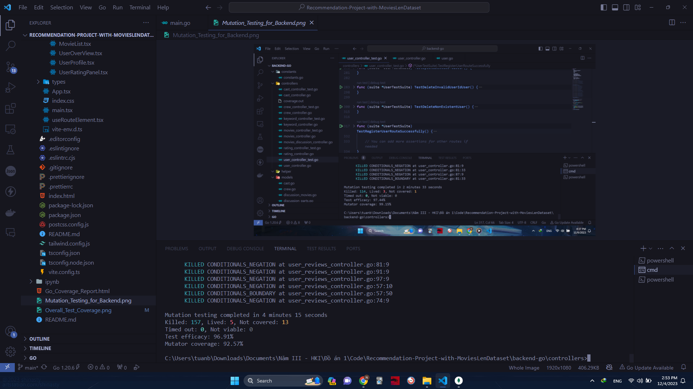

# Recommendation-Project-with-MoviesLenDataset

## Testing

### Unit Testing
The package used to write test is [testify](https://github.com/stretchr/testify).
Testing coverage: 96.8% 

The test coverage for each controller:

[Controller test coverage](Go_Coverage_Report.html)

### Mutation Testing
The package used to implement mutation test is: [gremlins](https://github.com/go-gremlins/gremlins)

Mutator Coverage: 99.15%

Test efficacy: 97.44%

